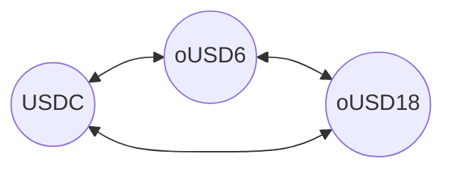
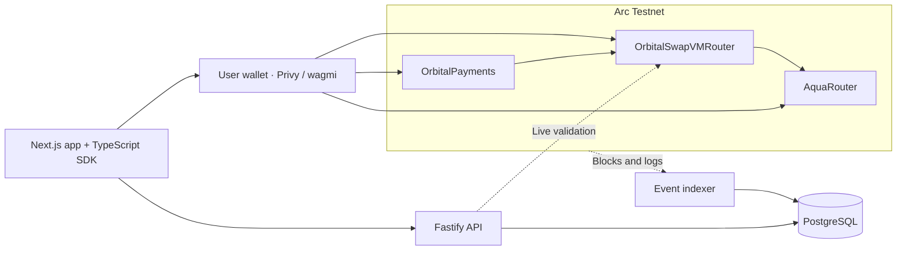

<p align="center">
  
</p>

<h1 align="center">Orbital</h1>

<p align="center"><strong>Trade stablecoins. Keep liquidity in your wallet. Get paid in USDC.</strong></p>

<p align="center">
  <a href="https://orbital-olive-omega.vercel.app">Launch app</a> ·
  <a href="https://orbital-olive-omega.vercel.app/docs">Protocol guide</a> ·
  <a href="#deployed-contracts">Contract addresses</a> ·
  <a href="#local-development">Run locally</a>
</p>

Orbital is a **multi-asset stablecoin AMM and payments application on Arc Testnet**. It adapts the [Orbital research](https://www.paradigm.xyz/writing/orbital) to independent maker-owned strategies, combining concentrated liquidity, **1inch Aqua**, custom **SwapVM** instructions, and **Privy** wallet onboarding.

A provider chooses the assets and trading rules. Traders exchange against that strategy, and merchants use the same swap engine to receive USDC.

> **Your wallet holds the assets. Your strategy sets the rules.** Liquidity is an allocation over wallet-held tokens. Assets move when an authorized trade settles.

[Product](#product) · [How it works](#how-it-works) · [Mathematics](#mathematical-model) · [Integrations](#sponsor-integrations) · [Evidence](#verification-and-scope)

## Product

| Trade | Provide liquidity | Accept payments |
| --- | --- | --- |
| Get a live quote, review the fee and minimum output, and confirm the swap from your wallet. | Select any pair or all three supported assets. Choose a concentration profile, allocate tokens, and publish your strategy. | Create a shareable USDC invoice. Accept USDC directly or let a payer fund settlement with a supported swap. |
| [Open Swap →](https://orbital-olive-omega.vercel.app/swap) | [Open Liquidity →](https://orbital-olive-omega.vercel.app/liquidity) | [Open Payments →](https://orbital-olive-omega.vercel.app/pay) |

Connect an existing browser wallet or use the configured Privy email and embedded-wallet flow. Public strategy information and the protocol guide are available without connecting.

## Deployed contracts

**Arc Testnet · Chain ID `5042002` · Gas paid in USDC**

These are the addresses used by the hosted application. Each address links directly to its [Arc explorer](https://testnet.arcscan.app) entry.

### Protocol contracts

| Contract | Address | Responsibility |
| --- | --- | --- |
| **AquaRouter** | [0xE60f79571E7EDba477ff98BAdeE618b5605DF7aE](https://testnet.arcscan.app/address/0xE60f79571E7EDba477ff98BAdeE618b5605DF7aE) | Wallet allocations and settlement. |
| **OrbitalSwapVMRouter** | [0x449420E9042c48Eac6E695020613678aD5A55D41](https://testnet.arcscan.app/address/0x449420E9042c48Eac6E695020613678aD5A55D41) | Strategy lifecycle, fees, and swaps. |
| **OrbitalPayments** | [0xf64e4664D534AeA5d240e1E29DAE9E80D2e393d6](https://testnet.arcscan.app/address/0xf64e4664D534AeA5d240e1E29DAE9E80D2e393d6) | USDC invoices and atomic payments. |

### Supported tokens

| Token | ERC-20 decimals | Address |
| --- | --- | --- |
| **USDC** | 6 | [0x3600000000000000000000000000000000000000](https://testnet.arcscan.app/address/0x3600000000000000000000000000000000000000) |
| **oUSD6** | 6 | [0x37af59078638387f0416Bef031D8D70B9B6b00f2](https://testnet.arcscan.app/address/0x37af59078638387f0416Bef031D8D70B9B6b00f2) |
| **oUSD18** | 18 | [0xCa8c7b1d7489BDd0bbD4e2f51Ee7558e14B2725B](https://testnet.arcscan.app/address/0xCa8c7b1d7489BDd0bbD4e2f51Ee7558e14B2725B) |

USDC is Arc's existing system token; it was not deployed by this project. **oUSD6 and oUSD18 are faucet-minted demo assets, not LP receipt tokens, and have no redemption value.** Native USDC pays gas using an eighteen-decimal representation; its ERC-20 interface uses six decimals.

### Linked libraries

The router uses six deployed libraries for curve calculations, configuration, state, and settlement.

| Library | Address |
| --- | --- |
| [FrontierEndpoint](packages/contracts/src/libraries/FrontierEndpoint.sol) | [0xdA2E82aa2f5a1Ec1d103C507219380Cf5002eeD7](https://testnet.arcscan.app/address/0xdA2E82aa2f5a1Ec1d103C507219380Cf5002eeD7) |
| [FrontierComposition](packages/contracts/src/libraries/FrontierComposition.sol) | [0xDA1C415b6EC73E380a9C83e0e4ba809D7c28e3e5](https://testnet.arcscan.app/address/0xDA1C415b6EC73E380a9C83e0e4ba809D7c28e3e5) |
| [OrbitalOrderCodec](packages/contracts/src/libraries/OrbitalOrderCodec.sol) | [0x602d4CE6fBC11651ef70CfE273970625A970760A](https://testnet.arcscan.app/address/0x602d4CE6fBC11651ef70CfE273970625A970760A) |
| [StrategyInitializer](packages/contracts/src/libraries/StrategyInitializer.sol) | [0x63E45d5038eAFff718a15Ef6C474C4A07b53D3A2](https://testnet.arcscan.app/address/0x63E45d5038eAFff718a15Ef6C474C4A07b53D3A2) |
| [OrbitalStorage](packages/contracts/src/libraries/OrbitalStorage.sol) | [0xbc80763Cad55C35ca534C59246F97290198Ada38](https://testnet.arcscan.app/address/0xbc80763Cad55C35ca534C59246F97290198Ada38) |
| [OrbitalSettlement](packages/contracts/src/libraries/OrbitalSettlement.sol) | [0xB73ABbFa96AcC4bC40C9ac0dB729FcfAf3728F20](https://testnet.arcscan.app/address/0xB73ABbFa96AcC4bC40C9ac0dB729FcfAf3728F20) |

**Deployment records:** [Hosted manifest and token allowlist](deployments/5042002/hosted-manifest.json) · [Runtime, bindings, and deployment receipts](deployments/5042002/verification.json)

AquaRouter is a project-deployed copy of the pinned upstream code, separate from the canonical 1inch deployment. The records cover **11 project-deployed contracts**, plus the existing USDC asset listed above.

## How it works

### One strategy. Every pair.

A strategy containing USDC, oUSD6, and oUSD18 supports **six directed trading pairs against one shared inventory and pricing state**. A USDC → oUSD6 swap changes the state used by the next trade—even when that trade uses a different pair. Each maker's strategy has its own inventory and fee accounting.



A pair is available only when the strategy has enough Aqua allocation, wallet balance, and allowance. A maker cannot trade against their own strategy.

### Publish the strategy. Keep the custody.

1. **Configure.** Choose at least two supported assets, equal starting token amounts, a **Wide**, **Balanced**, or **Focused** profile, and a trading fee.
2. **Approve and publish.** Approve Aqua, publish the allocation, and activate the Orbital strategy. Each step is reviewed in the wallet.
3. **Trade.** Eligible swaps draw output from your wallet and send gross input back to it. The maker fee stays in your wallet and is accounted for separately from curve principal.
4. **Manage.** Retire the strategy and dock its Aqua allocation to stop it. Retirement is terminal; a new size or configuration requires a new order. Docking removes the allocation and transfers no tokens.

The active order's assets, tick configuration, and fee are immutable. Spending allocated tokens elsewhere or reducing an allowance can make the strategy unavailable.

### From quote to settlement

The trader chooses an exact input amount. Orbital finds an eligible strategy, checks its current backing, and calculates the output. After any necessary token approval, the app refreshes the quote for a final review of the recipient, minimum output, deadline, and gas estimate.

The wallet signs; the contracts apply the fee, validate the curve path, and settle through Aqua. A confirmed receipt records what moved. Submitted transaction hashes support receipt recovery after an interrupted browser session.

### Pay in a supported token. Settle in USDC.

A merchant creates an invoice with a fixed USDC amount, an expiry, and **up to three recipients**. The payer can use USDC directly or fund payment through an available swap.

For a swap-funded payment, the adapter checks the amount due and the payer's minimum output, distributes USDC to the recipients, refunds excess USDC, and marks the invoice paid **in one transaction**. A failed swap or required recipient transfer reverts the payment together. Any required token approval happens beforehand.

[Explore the full protocol guide →](https://orbital-olive-omega.vercel.app/docs)

## Mathematical model

Orbital concentrates liquidity around the equal-price region while keeping several assets in one trading system. Think of reserves as a point on a curved surface: a swap adds one asset and removes another, moving that point. The curve determines the output; it does not force a fixed one-for-one exchange.

**Tighter ticks** focus capital near equal prices. **Wider ticks** cover a broader range of relative prices. A strategy combines several ticks, including a full-range anchor; the engine recalculates their contributions as a trade crosses boundaries.

<details>
<summary><strong>Explore the geometry, tick composition, and integer numerics</strong></summary>

The paper supplies the geometric mechanism. The repository adapts ownership to independent Aqua makers and adds numerical validation for integer execution. This overview uses **real, normalized geometric reserves**; wallet balances, funded principal, and fee inventory are separate quantities.

### A spherical trading frontier

For a tick with radius $r>0$, $n\ge2$ assets, reserve vector $\mathbf{x}$, and all-ones vector $\mathbf{1}$, the ideal full-range frontier satisfies

```math
\left\|\mathbf{x}-r\mathbf{1}\right\|_2^2
=\sum_{i=1}^{n}(r-x_i)^2=r^2,
\qquad
x_i^{\mathrm{eq}}=r\left(1-\frac{1}{\sqrt{n}}\right).
```

The equal-price point is symmetric across assets. A trade adds one coordinate and removes another along an admissible path; the mechanism does not promise a fixed one-for-one exchange.

### Concentration through spherical caps

An ordinary concentrated tick uses the convex reserve set

```math
C(r,b)=\left\{\mathbf{x}\in\mathbb{R}^{n}:
\left\|\mathbf{x}-r\mathbf{1}\right\|_2^2\le r^2,
\quad \mathbf{1}^{\mathsf T}\mathbf{x}\le rb\right\}.
```

Here $b$ is the repository's normalized reserve-sum boundary, related to the paper's projection coordinate by $b=\sqrt{n}\,k/r$. Ordinary boundaries satisfy $n-\sqrt{n}<b<n-1$, with additional quantization and nondegeneracy checks. The full-range anchor is handled separately. Virtual offsets reduce the funded principal needed for concentrated ticks; geometric coordinates must therefore not be read as ERC-20 balances.

### How interior and boundary ticks combine

Let $I$ and $D$ denote the interior and boundary tick sets. The engine tracks three aggregate quantities:

```math
\begin{aligned}
R&=\sum_{t\in I}r_t, &
K&=\sum_{t\in D}r_t b_t, &
S&=\sum_{t\in D}r_t\sigma(b_t),\\
\sigma(b)&=\sqrt{1-\frac{(b-n)^2}{n}}.
\end{aligned}
```

For total geometric reserves $\mathbf{X}$, define $A=\sum_i X_i$ and $\rho=\sqrt{\sum_i X_i^2-A^2/n}$. On the ideal combined frontier,

```math
F(\mathbf{X};R,K,S)
=\frac{(A-K-nR)^2}{n}+(\rho-S)^2=R^2.
```

This expression is used with the physical-branch requirements $R>0$, $\rho\ge S$, $A-K\le nR$, and nonnegative supporting prices. The boundary contribution $S$ is a sum of individual transverse radii. It cannot generally be replaced by a single radius reconstructed from an aggregated boundary.

An integer state satisfying $F\le R^2$ is not sufficient by itself. The implementation also checks the tick partition, per-tick reconstruction, funded principal, supporting-price branch, and bounded rounding slack. Traversal must account for both inward and outward crossings; an endpoint-only check can miss an intervening boundary.


### Numerical implementation

Solidity execution uses fixed-point arithmetic, wide intermediate operations, directed bounds, and conservative final output rounding. Quotes run the same curve path without committing state. An independent Python reference evaluates explicit per-tick baskets at high precision and supplies fixtures for comparison with the contract engine.

Trading fees are charged once on gross input. With raw input $q$ and a maker fee $f$ in parts per million:

```math
q_{\mathrm{fee}}=\left\lceil\frac{qf}{10^6}\right\rceil,
\qquad q_{\mathrm{net}}=q-q_{\mathrm{fee}}.
```

The curve prices the net input; Aqua settles the gross input. A fee that consumes the entire input is rejected. Numerical uncertainty produces a typed failure rather than an unchecked output.

**Technical references:** [Mathematical definitions](docs/MATH.md) · [Integer numerics](docs/NUMERICS.md) · [Paper-to-code traceability](docs/PAPER_IMPLEMENTATION.md) · [Independent reference](packages/reference) · [Open release obligations](docs/audits/RELEASE_GAP_REVIEW.md)

</details>

## Sponsor integrations

### 1inch · Aqua and SwapVM

**Aqua supplies wallet-backed allocation and settlement.** Makers approve Aqua and publish the full encoded order as an allocation. Orbital activates the corresponding configuration. During a trade, Aqua pushes gross input to the maker and pulls output to the recipient.

**SwapVM supplies the execution framework.** The pinned fork adds shared token resolution so one multi-token order can execute different pairs against the same strategy state. The router runs a fixed two-instruction program:

| Opcode | Instruction | Purpose |
| --- | --- | --- |
| `0x72` | `OrbitalFeeIn(configHash)` | Charge the fee once, price with net input, then restore gross input for settlement. |
| `0x52` | `OrbitalSwap(configHash)` | Calculate output and validate the tick path; commit state only during a swap. |

Both instructions bind the same configuration hash. The router rejects extra instructions, repeated fees, and mismatched configurations. The full encoded order identifies the Aqua allocation.

[Router and dispatch](packages/contracts/src/OrbitalSwapVMRouter.sol) · [Pinned SwapVM fork](packages/contracts/vendor/swap-vm-orbital) · [Mixed execution tests](packages/contracts/test/MixedExecution.t.sol) · [Integration notes](docs/AQUA_RESEARCH.md)

### Arc · USDC settlement and atomic payments

Arc Testnet hosts the strategies, execution contracts, and invoice adapter. USDC serves as both the settlement asset and the native gas currency. The application handles their different decimal representations and reserves USDC for execution.

The payment adapter connects the swap engine to merchant invoices, recipient splits, and excess-output refunds. Required settlement steps succeed together or revert together.

[Payment adapter](packages/contracts/src/OrbitalPayments.sol) · [Network configuration](apps/web/src/wallet/config.ts) · [Arc integration notes](docs/ARC_RESEARCH.md)

### Privy · Wallet onboarding

Privy provides email sign-in, embedded EVM wallet creation, and existing-wallet connection. Its wagmi integration connects the selected wallet to the shared swap, strategy, and payment controllers.

Users review and authorize transactions in the wallet. The backend does not receive email identities or sign transactions; onchain invoices contain no Privy identity fields. Receipt recovery does not automatically request another signature.

[Privy provider](apps/web/src/wallet/PrivyWallet.tsx) · [Transaction bridge](apps/web/src/wallet/WalletProvider.tsx) · [Integration notes](docs/PRIVY_RESEARCH.md)

The retained checks cover the public login interface and shared application flows. Authenticated association between a Privy embedded wallet and the recorded swap/payment receipts remains unverified.

## System architecture

The SDK and feature controllers validate inputs and construct transactions. The API and indexer provide observations. Wallets authorize execution; contracts determine whether it can settle.



The frontend runs on **Vercel**. **Railway** hosts the API, indexer, and PostgreSQL. [Public API](https://api-production-2182.up.railway.app) · [Hosting runbook](docs/HOSTING.md)

## Recorded Arc execution

| Operation | Observed result | Evidence |
| --- | --- | --- |
| Strategy activation | Three assets allocated with 10 units each and a 0.05% fee. | [Transaction](https://testnet.arcscan.app/tx/0x93fe7e8e901e8b12939bd5c3af3f0ec59b30368f1e926999f7f0c2b540f542cb) · [Checked record](test/evidence/arc-integration/first-strategy.json) |
| Swap | 1 USDC → 0.998491 oUSD6; 0.0005 USDC fee. | [Transaction](https://testnet.arcscan.app/tx/0xc27397b2bb8557175cc1a824e501046eb4c1373fe396f437c7a0b6737c488e56) · [Checked record](test/evidence/arc-integration/first-swap.json) |
| Swap-funded invoice | 0.5 oUSD6 input; 0.5 USDC paid; 0.000507 USDC refunded. | [Transaction](https://testnet.arcscan.app/tx/0xb785144b6eb1ed84de359553602c8a3b6e429a6303f3312294f5961576b01877) · [Checked record](test/evidence/arc-integration/first-payment.json) |

These are historical receipt observations, not current quotes. The hosted index begins at the documented test-view block and does not include all activity since the original deployment. The linked records preserve the earlier demonstrations independently of that hosted view.

## Local development

### Prerequisites

Node.js **22**, pnpm **10.34.5**, Python **3.12**, Foundry **1.5.1**, and Docker with Compose. Compiler and application dependencies are pinned in the repository.

```bash
git clone https://github.com/AnInsaneJimJam/aqua-orbital.git
cd aqua-orbital
pnpm install --frozen-lockfile
python -m pip install -r packages/reference/requirements.txt
pnpm local:setup
pnpm dev:local
```

Open **http://127.0.0.1:3000**; the local API runs on **http://127.0.0.1:3001**.

`local:setup` starts PostgreSQL and a persistent Anvil chain, builds and verifies the local contracts, applies migrations, and seeds demo makers and an invoice. The local profile uses unlocked test accounts and needs no Privy credentials. `pnpm demo:judge` lists demo links and indexed records.

For the existing Arc deployment, complete the [Arc profile setup](docs/ARC_DEMO.md), then run `pnpm dev:arc`. The Arc profile uses ports **3002/3003** and real wallet connections. Follow the [local runbook](docs/LOCAL_DEMO.md) for fixtures, persistence, and recovery.

### Common commands

| Command | Purpose |
| --- | --- |
| `pnpm typecheck` | Check workspace TypeScript types. |
| `pnpm test:reference` | Run the existing Python mathematical reference suite. |
| `pnpm test:contracts` | Run the existing Foundry contract suite. |
| `pnpm test:shared` / `pnpm test:sdk` | Check schemas, encoding, financial plans, and recovery helpers. |
| `pnpm test:database` / `pnpm test:indexer` / `pnpm test:backend` | Run backend integration checks against a test database. |
| `pnpm test:e2e` | Run browser workflow checks with isolated fixtures. |
| `pnpm build` | Build the workspaces. |
| `pnpm evidence:build` | Rebuild evidence summaries; this does not run tests. |

Database integration tests require PostgreSQL and `TEST_DATABASE_URL`. Browser tests require `pnpm --filter @orbital/web exec playwright install chromium`. See the [local runbook](docs/LOCAL_DEMO.md) for database configuration. Browser wallet/RPC fixtures do not establish live provider authentication or mined execution.

## Verification and scope

Verification records are dated and tied to their source inputs. They are not a claim that every current check passes or that the protocol has completed release acceptance.

| Checkpoint | Recorded result | Scope and evidence |
| --- | --- | --- |
| Existing engine suites · September 9, 2026 | 404 contract tests and 129 reference tests passed. | [Default-profile runs, manifests, source hashes, and exclusions](test/evidence/engine-suite/README.md). |
| Selected-token profiles · September 13, 2026 | 81 read-only initializer comparisons, nine local pair/profile lifecycles, and six browser checks passed. | [Selected assets, exact bounds, and independent 110/160-digit checks](test/evidence/selected-token-profiles/README.md). Larger baskets were initializer inputs, not additional deployed assets. |
| Wallet/receipt consistency · September 9, 2026 | 53 offline checks passed for the retained swap and payment. | [Signed transaction reconstruction, transfer matching, and provider limitation](test/evidence/privy-association-basic/README.md). |
| Arc deployment and financial execution | Runtime/binding verification and recorded successful transactions. | [Deployment verification](deployments/5042002/verification.json) and the receipt records above. |

Three SDK tests retain stale Aqua ABI-count assertions, documented in the [selected-token checkpoint](test/evidence/selected-token-profiles/README.md). Full supported-range mathematical liveness, broader differential/economic campaigns, worst-case gas, security review, and release acceptance remain open. This is an **experimental testnet application**, not an independently audited mainnet release.

`GET /health` checks the API process. `GET /ready` also requires a fresh canonical index matching the deployment. A new database needs its initial history sync before liquidity and quotes become available.

The current deployment supports the three listed tokens and uses three-tick publication presets. Contract limits of **2–8 assets**, **up to 8 ticks**, and **16 crossings per swap** describe the supported shape; they do not establish execution coverage for every configuration.

## Repository and documentation

| Location | Responsibility |
| --- | --- |
| [`apps/web`](apps/web) | Application, wallet integration, transaction presentation, and public protocol guide. |
| [`apps/api`](apps/api) | Quote, strategy, invoice, metric, readiness, and event-stream APIs. |
| [`apps/indexer`](apps/indexer) | Chain event ingestion, canonical projections, and bounded reorg recovery. |
| [`packages/contracts`](packages/contracts) | Router, curve libraries, payment adapter, and pinned upstream code. |
| [`packages/sdk`](packages/sdk) | Strategy derivation, encoding, transaction plans, validation, and recovery. |
| [`packages/reference`](packages/reference) | Independent mathematical model and high-precision fixtures. |
| [`packages/db`](packages/db) / [`packages/shared`](packages/shared) | Database schema/migrations and validated shared types. |
| [`docs`](docs) / [`test/evidence`](test/evidence/INDEX.md) | Design decisions, source provenance, runbooks, and dated verification. |

**Start here:** [Master specification](MASTER_PROMPT.md) · [Progress](PROGRESS.md) · [Decisions](docs/DECISIONS.md) · [Frontend architecture](docs/FRONTEND.md) · [Hosting](docs/HOSTING.md)

## Research and attribution

Orbital adapts the [Orbital research](https://www.paradigm.xyz/writing/orbital) by **Dan Robinson, Ciamac Moallemi, and Dave White**, published June 2, 2025. The [source record](docs/sources/orbital.json) and [implementation ledger](docs/PAPER_IMPLEMENTATION.md) distinguish the paper's model, repository notation, numerical choices, and the Aqua ownership adaptation.

The implementation uses [1inch Aqua](https://github.com/1inch/aqua) and a pinned [SwapVM](https://github.com/1inch/swap-vm) fork. See [asset provenance](docs/ASSETS.md) for the interface artwork and fonts.

Powered by SwapVM — © Degensoft Ltd 2025. Vendored code and fonts retain their upstream licenses and notices. This project does not imply endorsement by Paradigm or the upstream projects.
