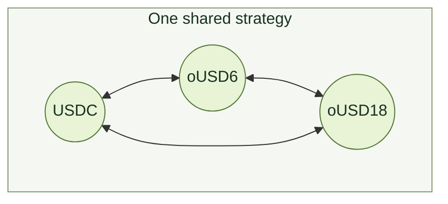
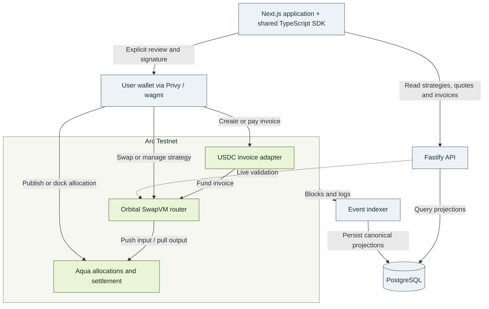

<p align="center">
  
</p>

<h1 align="center">Orbital</h1>

<p align="center"><strong>Multi-asset concentrated liquidity. Wallet-held capital. USDC settlement.</strong></p>

<p align="center">
  <a href="https://orbital-olive-omega.vercel.app">Launch application</a> ·
  <a href="https://orbital-olive-omega.vercel.app/docs">Read the protocol guide</a> ·
  <a href="test/evidence/INDEX.md">Explore execution evidence</a>
</p>

Orbital is a multi-asset stablecoin AMM and payments application on **Arc Testnet**. It adapts the [Orbital research](https://www.paradigm.xyz/writing/orbital) into maker-owned liquidity strategies using **1inch Aqua**, a custom **SwapVM** router, and **Privy** wallet onboarding.

A provider defines the assets, concentration, allocation, and fee for a strategy. Traders exchange against its shared inventory; merchants use the same execution engine to receive USDC. Assets remain in the provider's wallet until an authorized trade settles.

[Product](#product) · [Mathematics](#mathematical-model) · [Architecture](#system-architecture) · [Sponsors](#sponsor-integrations) · [Deployment](#deployment-and-demonstration) · [Development](#local-development) · [Evidence](#verification-and-scope)

## Product

| Workflow | Experience |
| --- | --- |
| **Trade** | Live strategy quotes, configurable slippage, separate approval and swap reviews, gas estimates, and receipt-based confirmation. |
| **Provide liquidity** | Select any pair or all three deployed assets; choose a Wide, Balanced, or Focused profile; publish, activate, retire, and dock from your wallet. |
| **Accept payments** | Create a shareable USDC invoice with an expiry and up to three recipients. Accept USDC directly or fund the payment through a supported swap. |
| **Connect** | Use an existing browser wallet or the configured Privy email and embedded-wallet flow. Public browsing requires no wallet. |
| **Inspect** | Read strategy state, indexed activity, actual transaction receipts, mathematical notes, and source-linked verification records. |

### One strategy, every supported pair

The three-asset demonstration supports **six directed trading pairs** within one maker's strategy. Every trade updates the inventory used by subsequent trades, including those involving a different pair.



The diagram shows permitted directions, not prices or guaranteed route availability. A published strategy must still have sufficient Aqua allocation, wallet balances, and allowances. A maker cannot trade against their own strategy.

### From allocation to settlement

1. **Configure:** select supported assets, equal starting amounts, a concentration profile, and a fee.
2. **Publish:** approve Aqua, publish the allocation, and activate the Orbital strategy through separate wallet-reviewed steps.
3. **Quote:** discover eligible strategies and validate their current configuration, backing, and curve output.
4. **Execute:** review and sign the exact-input transaction. The contracts apply the fee, evaluate the curve, and settle through Aqua.
5. **Recover:** retain the submitted transaction hash and decode the confirmed receipt, including after an interrupted browser session.

An active order's token set, tick configuration, and fee are immutable. Retirement is terminal; a new configuration uses a new order. Docking removes the Aqua allocation and transfers no tokens. Maker fees arrive with the gross input and are accounted for separately from curve principal.

## Mathematical model

The paper supplies the geometric mechanism. The repository adapts ownership to independent Aqua makers and adds numerical validation for integer execution. This overview uses **real, normalized geometric reserves**; wallet balances, funded principal, and fee inventory are separate quantities.

### A spherical trading frontier

For a tick with radius $r>0$, $n\ge2$ assets, reserve vector $\mathbf{x}$, and all-ones vector $\mathbf{1}$, the ideal full-range frontier satisfies

```math
\left\|\mathbf{x}-r\mathbf{1}\right\|_2^2
=\sum_{i=1}^{n}(r-x_i)^2=r^2,
\qquad
x_i^{\mathrm{eq}}=r\left(1-\frac{1}{\sqrt{n}}\right).
```

The equal-price point is symmetric across assets. A trade adds one coordinate and removes another along an admissible path; the mechanism does not promise a fixed one-for-one exchange.

### Concentration through spherical caps

An ordinary concentrated tick uses the convex reserve set

```math
C(r,b)=\left\{\mathbf{x}\in\mathbb{R}^{n}:
\left\|\mathbf{x}-r\mathbf{1}\right\|_2^2\le r^2,
\quad \mathbf{1}^{\mathsf T}\mathbf{x}\le rb\right\}.
```

Here $b$ is the repository's normalized reserve-sum boundary, related to the paper's projection coordinate by $b=\sqrt{n}\,k/r$. Ordinary boundaries satisfy $n-\sqrt{n}<b<n-1$, with additional quantization and nondegeneracy checks. The full-range anchor is handled separately. Virtual offsets reduce the funded principal needed for concentrated ticks; geometric coordinates must therefore not be read as ERC-20 balances.

<details>
<summary><strong>How interior and boundary ticks combine</strong></summary>

Let $I$ and $D$ denote the interior and boundary tick sets. The engine tracks three aggregate quantities:

```math
\begin{aligned}
R&=\sum_{t\in I}r_t, &
K&=\sum_{t\in D}r_t b_t, &
S&=\sum_{t\in D}r_t\sigma(b_t),\\
\sigma(b)&=\sqrt{1-\frac{(b-n)^2}{n}}.
\end{aligned}
```

For total geometric reserves $\mathbf{X}$, define $A=\sum_i X_i$ and $\rho=\sqrt{\sum_i X_i^2-A^2/n}$. On the ideal combined frontier,

```math
F(\mathbf{X};R,K,S)
=\frac{(A-K-nR)^2}{n}+(\rho-S)^2=R^2.
```

This expression is used with the physical-branch requirements $R>0$, $\rho\ge S$, $A-K\le nR$, and nonnegative supporting prices. The boundary contribution $S$ is a sum of individual transverse radii. It cannot generally be replaced by a single radius reconstructed from an aggregated boundary.

An integer state satisfying $F\le R^2$ is not sufficient by itself. The implementation also checks the tick partition, per-tick reconstruction, funded principal, supporting-price branch, and bounded rounding slack. Traversal must account for both inward and outward crossings; an endpoint-only check can miss an intervening boundary.

</details>

### Numerical implementation

Solidity execution uses fixed-point arithmetic, wide intermediate operations, directed bounds, and conservative final output rounding. Quotes run the same curve path without committing state. An independent Python reference evaluates explicit per-tick baskets at high precision and supplies fixtures for comparison with the contract engine.

Trading fees are charged once on gross input. With raw input $q$ and a maker fee $f$ in parts per million:

```math
q_{\mathrm{fee}}=\left\lceil\frac{qf}{10^6}\right\rceil,
\qquad q_{\mathrm{net}}=q-q_{\mathrm{fee}}.
```

The curve prices the net input; Aqua settles the gross input. A fee that consumes the entire input is rejected. Numerical uncertainty produces a typed failure rather than an unchecked output.

**Technical references:** [Mathematical definitions](docs/MATH.md) · [Integer numerics](docs/NUMERICS.md) · [Paper-to-code traceability](docs/PAPER_IMPLEMENTATION.md) · [Independent reference](packages/reference) · [Open release obligations](docs/audits/RELEASE_GAP_REVIEW.md)

## System architecture

The SDK and feature controllers own financial validation and transaction construction. Presentation components receive typed state and callbacks. The API and indexer provide observations; the selected wallet signs, and the contracts determine whether execution can settle.



| Layer | Technologies | Responsibility |
| --- | --- | --- |
| Application | Next.js, React, TypeScript, CSS Modules, Radix UI | Public browsing, strategy management, transaction reviews, responsive controls, and documentation. |
| Wallets | Privy, wagmi, viem | Onboarding, active-wallet selection, chain reads, simulation, user signatures, and receipt recovery. |
| Protocol | Solidity 0.8.30, Aqua, modified SwapVM | Strategy lifecycle, curve execution, fee accounting, settlement, and atomic payments. |
| Backend | Fastify, PostgreSQL, Drizzle | Validated financial APIs, event ingestion, indexed projections, freshness checks, and bounded reorg recovery. |
| Reference and verification | Python, mpmath, Foundry, Anvil, Playwright | Independent numerical fixtures, contract execution, local integration, and browser workflow checks. |
| Operations | pnpm, Docker Compose, Vercel, Railway | Reproducible workspaces, local services, hosted frontend, API, indexer, and database. |

## Sponsor integrations

### 1inch — Aqua and SwapVM

**Aqua provides wallet-backed allocation and settlement.** A maker approves Aqua and ships the encoded order as a strategy allocation. Orbital validates and activates the corresponding configuration. During a trade, gross input reaches the maker through Aqua's push flow, and output is pulled from the maker to the recipient. Current wallet balances and allowances remain part of execution eligibility.

**SwapVM provides the programmable execution framework.** The pinned fork adds shared token resolution so a single multi-token order can execute different pairs against the same state. The router accepts a fixed two-instruction program, with both instructions bound to the same configuration hash:

| Opcode | Instruction | Role |
| --- | --- | --- |
| `0x72` | `OrbitalFeeIn(configHash)` | Charge the fee once, run pricing with net input, then restore gross input for settlement. |
| `0x52` | `OrbitalSwap(configHash)` | Compute output and validate the tick path; commit state only during an actual swap. |

Initialization, numerical, storage, and settlement functionality use linked libraries to fit the EVM contract-size limit. Publication commits the full encoded order; hashing only its instruction bytes would bind a different Aqua strategy.

**Implementation:** [Custom router and dispatch](packages/contracts/src/OrbitalSwapVMRouter.sol#L112-L149) · [Pinned SwapVM fork](packages/contracts/vendor/swap-vm-orbital) · [Mixed execution tests](packages/contracts/test/MixedExecution.t.sol) · [Integration research](docs/AQUA_RESEARCH.md)

**Deployment provenance:** Arc uses a project-deployed copy of the pinned upstream AquaRouter. It is separate from the canonical 1inch deployment; runtime verification and sponsor acceptance are distinct questions.

### Arc — USDC trading and atomic payments

Arc Testnet hosts the strategies, execution contracts, and invoice adapter. USDC is the settlement asset and also pays network gas. The application handles the six-decimal ERC-20 interface and eighteen-decimal native gas representation separately, reserving enough USDC for execution.

A swap-funded payment converts an allowed input token into USDC, checks the invoice amount and payer's minimum output, distributes the requested recipient splits, and refunds excess USDC. The invoice becomes paid in the same transaction. A failed swap or required recipient transfer reverts the operation; any necessary ERC-20 approval precedes it as a separate transaction.

**Implementation:** [Atomic payment adapter](packages/contracts/src/OrbitalPayments.sol#L55-L102) · [Arc wallet configuration](apps/web/src/wallet/config.ts) · [Verified deployment](deployments/5042002/verification.json) · [Arc integration notes](docs/ARC_RESEARCH.md)

### Privy — wallet onboarding and financial flows

Privy supplies email sign-in, embedded EVM wallet creation, and existing-wallet connection. Its wagmi integration binds the selected wallet to the shared swap, strategy, and payment controllers. Users explicitly review approvals and execution; public browsing remains available before connection.

Provider-specific behavior is isolated in the wallet module. The backend does not receive email identities or sign transactions, and onchain invoices contain no Privy identity fields. Recovery reuses submitted public transaction data without automatically requesting another signature.

**Implementation:** [Privy provider and active-wallet bridge](apps/web/src/wallet/PrivyWallet.tsx) · [Shared transaction bridge](apps/web/src/wallet/WalletProvider.tsx) · [Configuration and qualification scope](docs/PRIVY_RESEARCH.md) · [Receipt association checks](test/evidence/privy-association-basic/README.md)

The retained checks establish the public login interface and shared application flows. Authenticated association between a Privy embedded wallet and the recorded swap/payment receipts remains unverified.

## Deployment and demonstration

| Resource | Location |
| --- | --- |
| Application | [orbital-olive-omega.vercel.app](https://orbital-olive-omega.vercel.app) |
| User-facing protocol guide | [How Orbital works](https://orbital-olive-omega.vercel.app/docs) |
| Public API | [api-production-2182.up.railway.app](https://api-production-2182.up.railway.app) |
| Network | Arc Testnet · chain ID `5042002` |
| Contract addresses and asset allowlist | [Hosted manifest](deployments/5042002/hosted-manifest.json) |
| Runtime, bindings, and deployment receipts | [Verification record](deployments/5042002/verification.json) |
| Hosting configuration | [Vercel and Railway runbook](docs/HOSTING.md) |

| Asset | ERC-20 decimals | Role |
| --- | --- | --- |
| USDC | 6 | Testnet settlement asset; native USDC also funds gas. |
| oUSD6 | 6 | Faucet-minted demo token. |
| oUSD18 | 18 | Faucet-minted demo token for mixed-decimal execution. |

**oUSD6 and oUSD18 have no redemption value and are not LP receipt tokens.** The current allowlist contains these three assets. Contract shape limits of 2–8 assets, up to 8 ticks, and 16 crossings per swap do not establish execution coverage across every supported configuration. The current publication presets use three ticks.

### Recorded Arc execution

| Operation | Observed result | Evidence |
| --- | --- | --- |
| Strategy activation | Three assets allocated with 10 units each and a 0.05% fee. | [Transaction](https://testnet.arcscan.app/tx/0x93fe7e8e901e8b12939bd5c3af3f0ec59b30368f1e926999f7f0c2b540f542cb) · [Checked record](test/evidence/arc-integration/first-strategy.json) |
| Swap | 1 USDC → 0.998491 oUSD6; 0.0005 USDC fee. | [Transaction](https://testnet.arcscan.app/tx/0xc27397b2bb8557175cc1a824e501046eb4c1373fe396f437c7a0b6737c488e56) · [Checked record](test/evidence/arc-integration/first-swap.json) |
| Swap-funded invoice | 0.5 oUSD6 input; 0.5 USDC paid; 0.000507 USDC refunded. | [Transaction](https://testnet.arcscan.app/tx/0xb785144b6eb1ed84de359553602c8a3b6e429a6303f3312294f5961576b01877) · [Checked record](test/evidence/arc-integration/first-payment.json) |

These are historical receipt observations, not current quotes. The hosted index begins at the documented test-view block and does not include all activity since the original deployment. The linked records preserve the earlier demonstrations independently of that hosted view.

## Local development

### Prerequisites

Node.js **22**, pnpm **10.34.5**, Python **3.12**, Foundry **1.5.1**, and Docker with Compose. Compiler and application dependencies are pinned in the repository.

```bash
git clone https://github.com/AnInsaneJimJam/aqua-orbital.git
cd aqua-orbital
pnpm install --frozen-lockfile
python -m pip install -r packages/reference/requirements.txt
pnpm local:setup
pnpm dev:local
```

Open **http://127.0.0.1:3000**; the local API runs on **http://127.0.0.1:3001**.

`local:setup` starts PostgreSQL and a persistent Anvil chain, builds and verifies the local contracts, applies migrations, and seeds demo makers and an invoice. The local profile uses unlocked test accounts and needs no Privy credentials. `pnpm demo:judge` lists demo links and indexed records.

For the existing Arc deployment, complete the [Arc profile setup](docs/ARC_DEMO.md), then run `pnpm dev:arc`. The Arc profile uses ports **3002/3003** and real wallet connections. Follow the [local runbook](docs/LOCAL_DEMO.md) for fixtures, persistence, and recovery.

### Common commands

| Command | Purpose |
| --- | --- |
| `pnpm typecheck` | Check workspace TypeScript types. |
| `pnpm test:reference` | Run the existing Python mathematical reference suite. |
| `pnpm test:contracts` | Run the existing Foundry contract suite. |
| `pnpm test:shared` / `pnpm test:sdk` | Check schemas, encoding, financial plans, and recovery helpers. |
| `pnpm test:database` / `pnpm test:indexer` / `pnpm test:backend` | Run backend integration checks against a test database. |
| `pnpm test:e2e` | Run browser workflow checks with isolated fixtures. |
| `pnpm build` | Build the workspaces. |
| `pnpm evidence:build` | Rebuild evidence summaries; this does not run tests. |

Database integration tests require PostgreSQL and `TEST_DATABASE_URL`. Browser tests require `pnpm --filter @orbital/web exec playwright install chromium`. See the [local runbook](docs/LOCAL_DEMO.md) for database configuration. Browser wallet/RPC fixtures do not establish live provider authentication or mined execution.

## Verification and scope

Verification records are dated and tied to their source inputs. They are not a claim that every current check passes or that the protocol has completed release acceptance.

| Checkpoint | Recorded result | Scope and evidence |
| --- | --- | --- |
| Existing engine suites · September 9, 2026 | 404 contract tests and 129 reference tests passed. | [Default-profile runs, manifests, source hashes, and exclusions](test/evidence/engine-suite/README.md). |
| Selected-token profiles · September 13, 2026 | 81 read-only initializer comparisons, nine local pair/profile lifecycles, and six browser checks passed. | [Selected assets, exact bounds, and independent 110/160-digit checks](test/evidence/selected-token-profiles/README.md). Larger baskets were initializer inputs, not additional deployed assets. |
| Wallet/receipt consistency · September 9, 2026 | 53 offline checks passed for the retained swap and payment. | [Signed transaction reconstruction, transfer matching, and provider limitation](test/evidence/privy-association-basic/README.md). |
| Arc deployment and financial execution | Runtime/binding verification and recorded successful transactions. | [Deployment verification](deployments/5042002/verification.json) and the receipt records above. |

Three SDK tests retain stale Aqua ABI-count assertions, documented in the [selected-token checkpoint](test/evidence/selected-token-profiles/README.md). Full supported-range mathematical liveness, broader differential/economic campaigns, worst-case gas, security review, and release acceptance remain open. This is an **experimental testnet application**, not an independently audited mainnet release.

`GET /health` checks the API process. `GET /ready` also requires a fresh canonical index matching the deployment. A new database needs its initial history sync before liquidity and quotes become available.

## Repository and documentation

| Location | Responsibility |
| --- | --- |
| [`apps/web`](apps/web) | Application, wallet integration, transaction presentation, and public protocol guide. |
| [`apps/api`](apps/api) | Quote, strategy, invoice, metric, readiness, and event-stream APIs. |
| [`apps/indexer`](apps/indexer) | Chain event ingestion, canonical projections, and bounded reorg recovery. |
| [`packages/contracts`](packages/contracts) | Router, curve libraries, payment adapter, and pinned upstream code. |
| [`packages/sdk`](packages/sdk) | Strategy derivation, encoding, transaction plans, validation, and recovery. |
| [`packages/reference`](packages/reference) | Independent mathematical model and high-precision fixtures. |
| [`packages/db`](packages/db) / [`packages/shared`](packages/shared) | Database schema/migrations and validated shared types. |
| [`docs`](docs) / [`test/evidence`](test/evidence/INDEX.md) | Design decisions, source provenance, runbooks, and dated verification. |

**Start here:** [Master specification](MASTER_PROMPT.md) · [Progress](PROGRESS.md) · [Decisions](docs/DECISIONS.md) · [Frontend architecture](docs/FRONTEND.md) · [Hosting](docs/HOSTING.md)

## Research and attribution

Orbital adapts the [Orbital research](https://www.paradigm.xyz/writing/orbital) by **Dan Robinson, Ciamac Moallemi, and Dave White**, published June 2, 2025. The [source record](docs/sources/orbital.json) and [implementation ledger](docs/PAPER_IMPLEMENTATION.md) distinguish paper statements, repository notation, numerical choices, and the Aqua ownership adaptation.

The implementation uses [1inch Aqua](https://github.com/1inch/aqua) and a pinned [SwapVM](https://github.com/1inch/swap-vm) fork. The interface incorporates the supplied paper visualization and SVG identity; see [asset provenance](docs/ASSETS.md).

Powered by SwapVM — © Degensoft Ltd 2025. Vendored code and fonts retain their upstream licenses and notices. This project does not imply endorsement by Paradigm or the upstream projects.