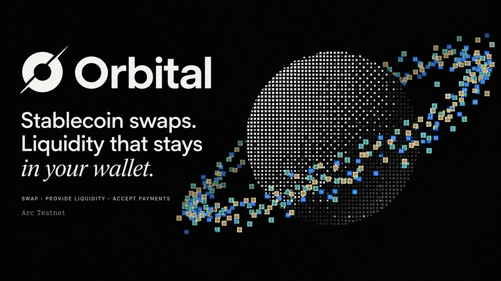

<p align="center">
  
</p>

<p align="center">
  <a href="https://orbital-olive-omega.vercel.app"><strong>Launch app</strong></a> ·
  <a href="https://orbital-olive-omega.vercel.app/docs">Documentation</a> ·
  <a href="#deployed-contracts">Contract addresses</a>
</p>

**Orbital** is a multi-asset stablecoin AMM and payments application on **Arc Testnet**. It combines concentrated liquidity, wallet-held allocations through **1inch Aqua**, and custom **SwapVM** execution.

- **Swap stablecoins** with live quotes, slippage controls, and wallet-reviewed execution.
- **Provide liquidity** for any pair or all three supported tokens. Choose a Wide, Balanced, or Focused strategy; tokens stay in your wallet until settlement.
- **Accept USDC payments** through shareable invoices, recipient splits, and atomic swap-funded settlement.
- **Connect with Privy** using a browser wallet or the configured email and embedded-wallet flow.

One strategy shares inventory across every pair in its basket. Available liquidity depends on the maker's allocation, wallet balance, and allowance. The curve determines prices; it does not force a 1:1 exchange.

## Our custom SwapVM opcodes

We built **two custom opcodes** to run Orbital's fee accounting and multi-asset curve inside SwapVM:

| Opcode | Instruction | What we implemented |
| --- | --- | --- |
| `0x72` | `OrbitalFeeIn(configHash)` | Charges the maker fee once, prices the net input, then restores gross input for settlement. |
| `0x52` | `OrbitalSwap(configHash)` | Calculates output, validates tick crossings, and commits strategy state during a swap. |

Both bind the same configuration hash and execute in that order. The pinned SwapVM fork adds token resolution so one strategy can serve multiple pairs.

[Router implementation](packages/contracts/src/OrbitalSwapVMRouter.sol) · [SwapVM fork](packages/contracts/vendor/swap-vm-orbital) · [Mathematics](docs/MATH.md)

## Built on Arc

**Arc Testnet** hosts our strategies, swaps, and payment contracts. **USDC pays gas and settles merchant invoices**, so users can trade and pay without a separate gas token. Swap-funded payments distribute USDC to recipients and refund excess output atomically.

[Payment contract](packages/contracts/src/OrbitalPayments.sol) · [Network configuration](apps/web/src/wallet/config.ts)

## Deployed contracts

**Arc Testnet · Chain ID `5042002` · Gas: USDC**

| Contract / token | Address |
| --- | --- |
| **AquaRouter** | [0xE60f79571E7EDba477ff98BAdeE618b5605DF7aE](https://testnet.arcscan.app/address/0xE60f79571E7EDba477ff98BAdeE618b5605DF7aE) |
| **OrbitalSwapVMRouter** | [0x449420E9042c48Eac6E695020613678aD5A55D41](https://testnet.arcscan.app/address/0x449420E9042c48Eac6E695020613678aD5A55D41) |
| **OrbitalPayments** | [0xf64e4664D534AeA5d240e1E29DAE9E80D2e393d6](https://testnet.arcscan.app/address/0xf64e4664D534AeA5d240e1E29DAE9E80D2e393d6) |
| **USDC · 6 decimals** | [0x3600000000000000000000000000000000000000](https://testnet.arcscan.app/address/0x3600000000000000000000000000000000000000) |
| **oUSD6 · 6 decimals** | [0x37af59078638387f0416Bef031D8D70B9B6b00f2](https://testnet.arcscan.app/address/0x37af59078638387f0416Bef031D8D70B9B6b00f2) |
| **oUSD18 · 18 decimals** | [0xCa8c7b1d7489BDd0bbD4e2f51Ee7558e14B2725B](https://testnet.arcscan.app/address/0xCa8c7b1d7489BDd0bbD4e2f51Ee7558e14B2725B) |

<details>
<summary>Linked libraries — all six deployed addresses</summary>

| Library | Address |
| --- | --- |
| FrontierEndpoint | [0xdA2E82aa2f5a1Ec1d103C507219380Cf5002eeD7](https://testnet.arcscan.app/address/0xdA2E82aa2f5a1Ec1d103C507219380Cf5002eeD7) |
| FrontierComposition | [0xDA1C415b6EC73E380a9C83e0e4ba809D7c28e3e5](https://testnet.arcscan.app/address/0xDA1C415b6EC73E380a9C83e0e4ba809D7c28e3e5) |
| OrbitalOrderCodec | [0x602d4CE6fBC11651ef70CfE273970625A970760A](https://testnet.arcscan.app/address/0x602d4CE6fBC11651ef70CfE273970625A970760A) |
| StrategyInitializer | [0x63E45d5038eAFff718a15Ef6C474C4A07b53D3A2](https://testnet.arcscan.app/address/0x63E45d5038eAFff718a15Ef6C474C4A07b53D3A2) |
| OrbitalStorage | [0xbc80763Cad55C35ca534C59246F97290198Ada38](https://testnet.arcscan.app/address/0xbc80763Cad55C35ca534C59246F97290198Ada38) |
| OrbitalSettlement | [0xB73ABbFa96AcC4bC40C9ac0dB729FcfAf3728F20](https://testnet.arcscan.app/address/0xB73ABbFa96AcC4bC40C9ac0dB729FcfAf3728F20) |

</details>

USDC is Arc's existing system token. **oUSD6 and oUSD18 are demo assets, not LP receipt tokens.** Our AquaRouter is a project deployment of upstream code, separate from the canonical 1inch deployment.

[Deployment manifest](deployments/5042002/hosted-manifest.json) · [Contract verification](deployments/5042002/verification.json)

## Development

Requires **Node.js 22**, **pnpm 10.34.5**, **Python 3.12**, **Foundry 1.5.1**, and **Docker Compose**.

```bash
git clone https://github.com/AnInsaneJimJam/aqua-orbital.git
cd aqua-orbital
pnpm install --frozen-lockfile
python -m pip install -r packages/reference/requirements.txt
pnpm local:setup
pnpm dev:local
```

Open **http://127.0.0.1:3000**. Setup starts the local chain and database, deploys contracts, and seeds demo data.

```bash
pnpm typecheck
pnpm test:contracts
pnpm test:reference
pnpm test:sdk
```

[Testing](docs/TESTS.md) · [Paper implementation](docs/PAPER_IMPLEMENTATION.md) · [Protocol guide](https://orbital-olive-omega.vercel.app/docs)

The monorepo contains the Next.js app, Fastify API, event indexer, Solidity contracts, shared TypeScript SDK, and independent Python reference.

## Status and credits

Experimental testnet software. Independent security review and full release campaigns remain open.

Adapted from the [Orbital research](https://www.paradigm.xyz/writing/orbital) by Dan Robinson, Ciamac Moallemi, and Dave White. Uses [1inch Aqua](https://github.com/1inch/aqua) and [SwapVM](https://github.com/1inch/swap-vm).

Powered by SwapVM — © Degensoft Ltd 2025. Vendored code and fonts retain their license notices. No endorsement by upstream projects is implied.
